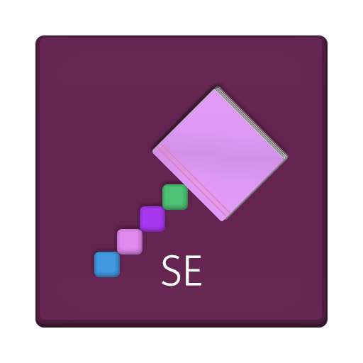
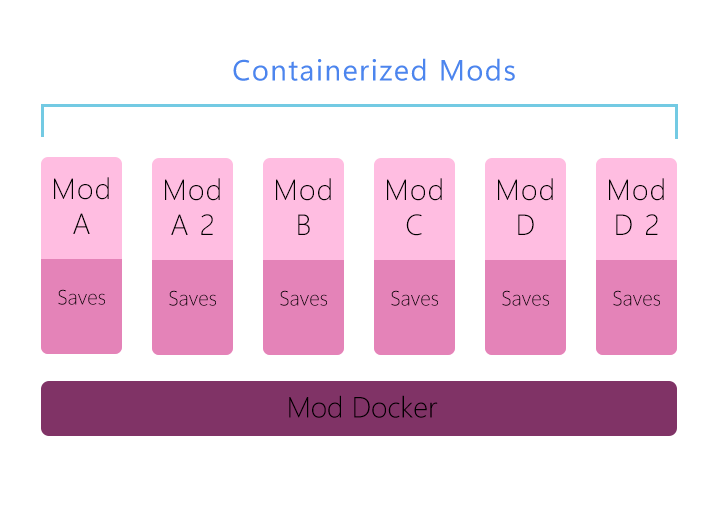
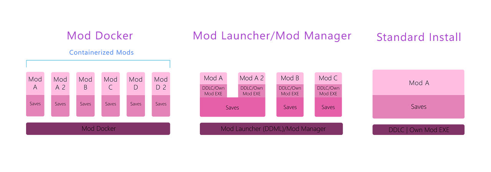

# Doki Doki Mod Docker

     

Doki Doki Mod Docker is a Ren'Py application that 'containerizes' (stores and runs multiple) Doki Doki Literature Club mods into one game.

> This project is in alpha. Expect bugs or several mods to not work as compared to other mod launchers/managers. To report mod incompatibility, report it either in [Issues](https://github.com/GanstaKingofSA/DDModDocker/issues) or [here](https://docs.google.com/forms/d/e/1FAIpQLSflrNfAf3vbBcpafv-3CEqszlGb8-P90IZAvloKVhiO10JzTQ/viewform).

> This project is unaffiliated with Team Salvato. See [BUILDING.md](BUILDING.md) on how to build Mod Docker with fixes for Pull Requests. Credits for DDMD can be seen by looking at [CREDITS.md](CREDITS.md).

## Features

- Ren'Py 8 mod compatiblity
- Mod installation
- Ability to store multiple mods in one game
- Separate saves
- Custom background
  > To add a custom background, put a 16:9 image into Mod Docker's game directory and name it `docker_custom_image`.
- [Beta] Auto scripts.rpa removal for certain mods.
- [Alpha] Auto MAS template built mods fixes.

## Installation

### For Windows/Linux

1. Download the latest version of Mod Docker [here](https://github.com/GanstaKingofSA/DDModDocker/releases).
2. Open the ZIP file and extract the _DokiDokiModDocker-X.X.X-ddmd8-win_ somewhere on your PC.
   > Do not install Mod Docker over DDLC.
3. Download DDLC's PC ZIP from [ddlc.moe](https://ddlc.moe), open the ZIP file, go to _DDLC-X.X.X-pc/game_ and copy `audio.rpa`, `fonts.rpa`, and `images.rpa` to Mod Docker's game folder.
4. Make a folder in Mod Docker's game folder called `mods`.
5. Open the _mods_ folder and make a folder for the mod you want to install.
   (I suggest the name of the mod or it's acroymn)
6. Copy the _game_ folder of the mod that you want to play to the mod folder you just made.
   > If there is no _game_ folder and all you have is just RPAs or RPYCs, make a 'game' folder in the mod folder you made and copy all the files into that folder.
7. Launch Mod Docker via DDMD.exe (DDMD.sh for Linux users).
8. Press F9 to open the Mod Docker menu and select your mod by clicking on it and pressing Select.
9. Restart the game and relaunch Mod Docker.
10. Done!

### For macOS

> In order to follow these steps, you must open DDMD by right-clicking the app, click "Show Package Contents" then go to "Contents/Resources/autorun".

1. Download the latest version of Mod Docker [here](https://github.com/GanstaKingofSA/DDModDocker/releases).
2. Open the ZIP file and extract the _DokiDokiModDocker-X.X.X-ddmd8-mac_ somewhere on your PC.
   > Do not install Mod Docker over DDLC.
3. Download DDLC's PC ZIP from [ddlc.moe](https://ddlc.moe), open the ZIP file, go to _DDLC-X.X.X-pc/game_ and copy `audio.rpa`, `fonts.rpa`, and `images.rpa` to Mod Docker's game folder.
4. Make a folder in Mod Docker's game folder called `mods`.
5. Open the _mods_ folder and make a folder for the mod you want to install.
   (I suggest the name of the mod or it's acroymn)
6. Copy the _game_ folder of the mod that you want to play to the mod folder you just made.
   > If there is no _game_ folder and all you have is just RPAs or RPYCs, make a 'game' folder in the mod folder you made and copy all the files into that folder.
7. Launch Mod Docker via DDMD.
8. Press F9 to open the Mod Docker menu and select your mod by clicking on it and pressing Select.
9. Restart the game and relaunch Mod Docker.
10. Done!

## Why Mod Docker?

- Simplicity
  > Mod Docker is a Ren'Py made mod container that serves to run all your favorite mods without the need of making separate copies of the game and the bloat of running traditional Ren'Py 8 mods using other mod launchers/managers or a manual installation. All mods (even multiple copies of the same mod) run as if you made a new installation of the mod.
- Built for players by the mod template developer.
  > Mod Docker is designed for players to play mods as easy as possible. From mods that may give us joy to those that turns the game as we know it upside down, I understand how much people care for creating and playing mods. Mod Docker sets a new standard of mod managing and playing that the competition doesn't have.

## What inspired Mod Docker?

Doki Doki Mod Launcher had the vision that Mod Docker has back in 2018, but due to my lack of coding expertise, it was more impractical. It required all modders to build a special DDML build rather than following the standard. Mod Docker revisits the old days of Mod Launcher, and revamps it to make the vision that I had all those years ago come to life with slight inspiration from [Docker](https://docker.com) itself.

## How does a 'mod container' work?

     

A mod container is basically a mod folder inside of Mod Docker where mods are stored and can be run without loading other mod files, touching saves from other mods and run as if it was a new standard mod installation. All mod containers contain a _game_ folder (sometimes a _characters_ folder) within that contains the mods' `RPAs`, `RPYC/RPY's` and other crucial folders like `mod_assets` that are loaded per mod selected.

## Comparing Mod Docker to Other Mod Launchers/Managers

While Mod Docker has some similarities to Doki Doki Mod Launcher/Mod Manager, Mod Docker functions as a hybrid approach to a mod launcher/manager and a standard install of a DDLC mod.

     

### Mod Docker

> Mod Docker uses a custom Ren'Py 6 (SE) 7 and 8 build that runs any selected mod as it's own mod (no matter if the mod is the same in two copies). It requires no external EXEs or the base game to work (except for the base game RPAs) to load the mods' own assets. It does not share save data of one mod throughout multiple copies.

### Doki Doki Mod Launcher/Doki Doki Mod Manager

> Doki Doki Mod Launcher/Doki Doki Mod Manager uses a custom Ren'Py 6/7 SDK build (Doki Doki Mod Launcher) or a custom-made program (Doki Doki Mod Manager) to store mods in one mod directory. They require the base game (and sometimes the mods' own EXE for Ren'Py 7 mods) to load the mods' own assets. They share save data of one mod throughout multiple copies. Ren'Py 8 mods are not compatible with Doki Doki Mod Launcher and possibly also Doki Doki Mod Manager.

### Standard Install

> Standard Install is the manual installation of a DDLC mod. It require the base game (and sometimes the mods' own EXE for Ren'Py 7/8 mods) to load the mods' own assets.

Copyright © 2022 Azariel Del Carmen (GanstaKingofSA). All rights reserved. Licensed under GNU AGPL-3.0. See [LICENSE](LICENSE) for more information.
